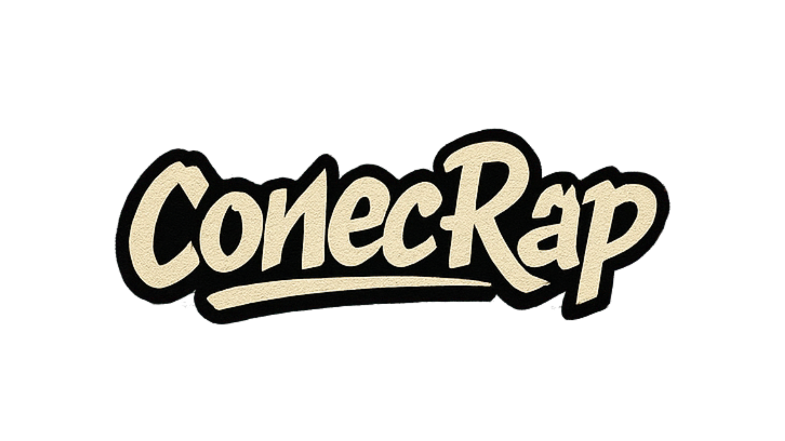
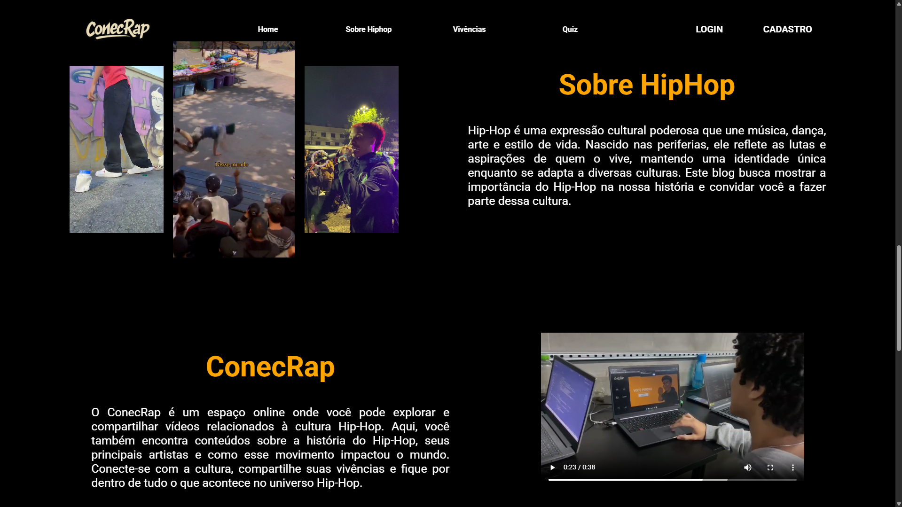
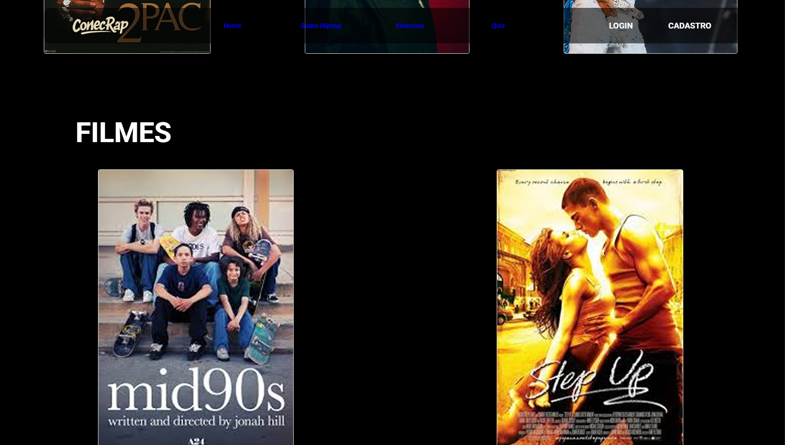
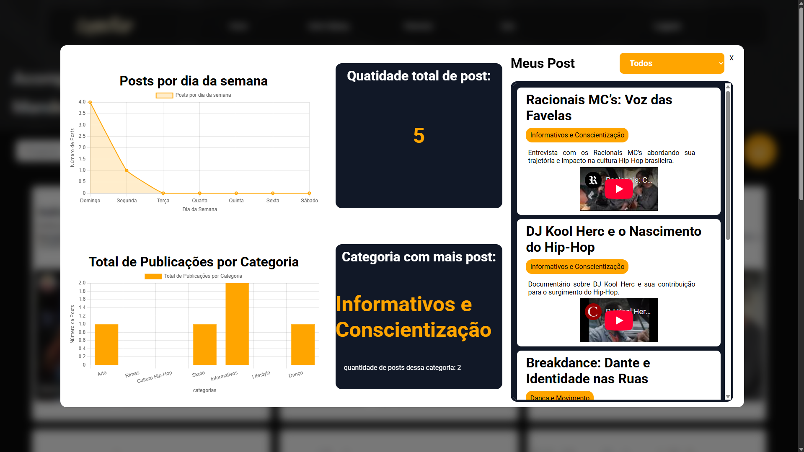
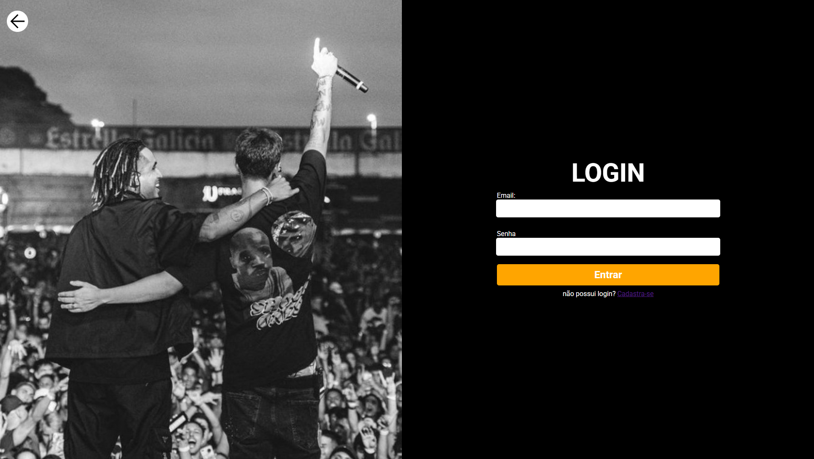
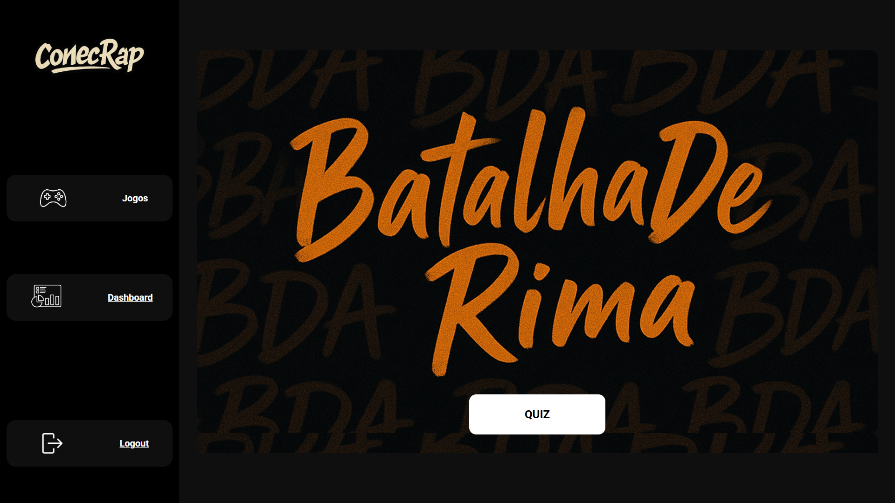
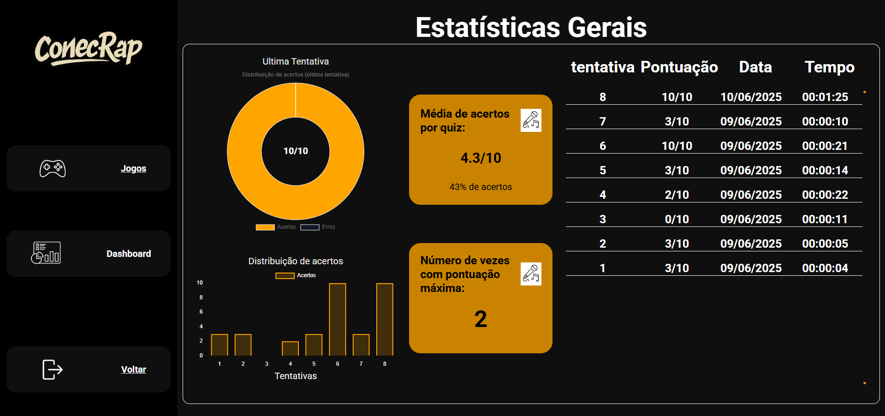

# 🎤 ConecRap - Plataforma Web de Cultura Hip-Hop



## 📘 Introdução

O **ConecRap** é uma plataforma web dedicada à valorização da cultura Hip-Hop. Ela oferece aos usuários uma imersão na história do movimento, interação por meio de posts, quizzes educativos e um sistema de login para personalizar a experiência.

---

## 🎯 Objetivo do Projeto

### Objetivo Geral
Criar uma aplicação web que promova a cultura Hip-Hop, com foco em educação, identidade e resistência.

### Objetivos Específicos
- Exibir a história do Hip-Hop com conteúdo visual.
- Oferecer quizzes educativos sobre o movimento.
- Permitir que usuários criem contas, publiquem posts e acompanhem seu desempenho.
- Criar uma área exclusiva para o usuário com seus dados e resultados.

---

## 📷 Screenshots

### Página Inicial




### Seção de História



### Tela de posts



### Página de Login e Cadastro



### Quiz em andamento


### Dashboard do quiz em andamento


---

## 📌 Funcionalidades

| ID    | Funcionalidade            | Descrição                                                                 |
|-------|---------------------------|---------------------------------------------------------------------------|
| RF01  | Cadastro de usuários      | Registro com e-mail e senha                                              |
| RF02  | Login e autenticação      | Acesso a áreas personalizadas                                            |
| RF03  | Página inicial            | Introdução ao Hip-Hop com links para outras seções                       |
| RF04  | Seção de história         | Exibição da origem e evolução do Hip-Hop                                 |
| RF05  | Criação de posts          | Usuários podem publicar conteúdos relacionados à cultura Hip-Hop         |
| RF06  | Visualização de posts     | Navegação pelos posts da comunidade                                      |
| RF07  | Quiz interativo           | Quiz sobre a história e elementos do Hip-Hop                             |


---

## ⚙️ Tecnologias Utilizadas

- Node.js
- MySQL
- HTML + CSS
- JavaScript

---

## 🛠️ Como executar o projeto localmente

```bash
# Clone o repositório
git clone https://github.com/HygorSW/ConecRap---Projeto-Individual-Sptech

# Acesse o diretório
cd ConecRap---Projeto-Individual-Sptech/Site

# Instale as dependências
npm install

# Configure o banco de dados no arquivo .env

# Rode o projeto
npm start
```

---

## 🧠 Sobre o Hip-Hop

O Hip-Hop é um movimento cultural que surgiu no Bronx, em Nova York, em 1970, como forma de resistência das comunidades negras e latinas. Ele é composto por quatro pilares fundamentais:

- 🎙️ **MC**: Rima com consciência social  
- 🎧 **DJ**: Manipulação de batidas  
- 🕺 **Breakdance**: Dança urbana e acrobática  
- 🎨 **Grafite**: Expressão visual nas ruas  

---

## 📅 Cronograma de Desenvolvimento

| Etapa              | Duração | Descrição                                              |
|--------------------|---------|----------------------------------------------------------|
| Planejamento       | 4 dias  | Levantamento de requisitos e estrutura inicial           |
| Desenvolvimento    | 14 dias  | Implementação das principais funcionalidades             |
| Funcionalidades Extra | 4 dias  | Ajustes de layout e testes                              |
| Finalização        | 2 dias  | Documentação e entrega final                             |

---

## ❌ Limites e Exclusões

- ❌ Não inclui app mobile nativo  
- ❌ Não possui curtidas ou comentários em posts  
- ❌ Não tem integração com redes sociais ou multilíngue  

---

## ✅ Requisitos Não Funcionais

- Interface intuitiva e acessível  
- Compatível com navegadores modernos  
- Código com boas práticas e preparado para manutenção  
- Acessibilidade mínima garantida  

---

## ⏳ Restrições

- 🗓️ Prazo final: **25/05**
- 👤 Desenvolvido por apenas **1 pessoa**
- 💻 Tecnologias obrigatórias: Node.js, MySQL, HTML, CSS e JavaScript

---

## ✊ Impacto Pessoal

> "O Hip-Hop foi minha porta de entrada para a educação e consciência social. Este projeto é uma homenagem à cultura que me formou, me deu voz e abriu caminhos."  

---

## 📎 Licença

Este projeto é de uso acadêmico, sem fins lucrativos. Realizado por: Hygor Silva.
